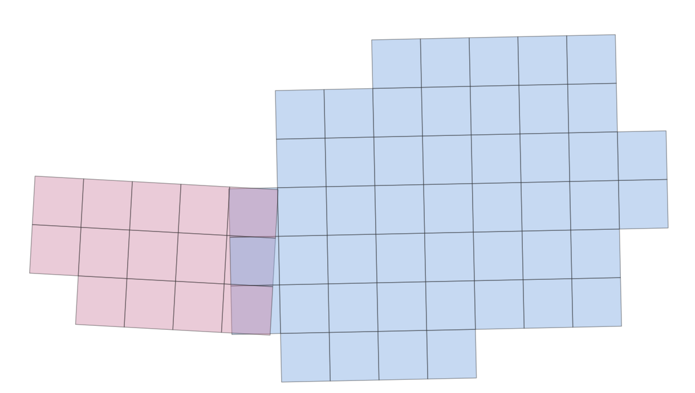

#  Printable OEK 50 Austrian Hiking Map Downloader 

---
## Idea

I decided to tackle this project for a couple of reasons:
- I love hiking, but access to regularly maintained and reliable map data can be tricky sometimes
- While digital maps (such as OSM or other subscription-based providers) have (sometimes) fantastic products, I prefer to have paper-based maps on all longer hikes. If not as the primary map, at least as a secondary emergency solution if digital navigation tools stop working (battery). Either way, I love paper maps more... its just more fun and more of a challenge
- Its surprising how many purchasable paper maps are really trash and not well done.. Luckily BEVs ÖK50 (1:50 000) hiking map is really good for hiking in Austria, both in the mountains and lowland regions. Sadly, these maps are sometimes tiled in ways which require me to get several individual maps for a single multi-day hike. While I dont object to purchasing good maps, it feels like a waste if I only need a small portion of it. Also, when travelling in groups, everybody should have a map, and that would make it even more expensive.
- There actually is an online version of the mentioned ÖK50, but the interface is useless if you want to get maps for areas larger than your screen, and the images are not georeferenced.
- I enjoy geospatial coding and it seemed like a fun task

Luckily, BEV publishes the underlying map tiles as COGs, which means they are super-user friendly and can be downloaded with range-requests, making it easy to get just those areas of the map in which I am interested.

All of this motivated me to construct a Python pipeline capable of creating fully printable maps (complete with a scale bar), just based on a user-provided AOI covering any small or large area in Austria. The pipeline works quite nicely, and together with a color printer, scissors, and some tape you can actually make a formidable and high resolution hiking map yourself! 

---
## Map Sample

Full downloaded map tile:

   

     
   

The presented workflow produces a pdf containing overlapping map tiles, each with a scale bar and (if requested) red annotations marks to highlight where to fold the individual pieces of paper to construct the full map.

---

## Design Choices

There are a couple of problems I faced when constructing this pipeline, leading me to take these design/processing choices:

1. **Image URL acquisition**

   First, I had to gather all the URLs for each map tile saved at BEVs servers. It turns out, individual links are embedded in the json request of BEVs catalogue search, which simplifies the process of URL gathering tremendously.
   With a first range-request I acquired all tile bounds and saved them in a Geodataframe (see `extract_oek50_img_urls.py`) for later intersecting and retrieving the correct tiles based on a user-provided AOI (which can be gathered from `bbox_draw_map.htlm` created by executing `bbox_map.py`). 

2. **Everlasting CRS mismatches**
   
   Well, it wouldnt be a geospatial project without CRS mismatches and reprojections... Map tiles are provided in two UTM strips: EPSG:25832 (pink) and EPSG:25833 (blue), which results in overlaps in Tirol.  

   

     
   

   I solved these, by working in the Austrian wide Lambert projection (EPSG:3416), to manage the intersections of user AOI with tile boundaries to determine which ones are intersected.

3. **Tile merging**

   To merge the individual tiles which cover the selected AOI (easy if only one tile is intersected), I intersect the AOI with the Geodataframe from step 1. 
   Next, the approximate majority area (in what CRS is more of my map data going to be in) was calculated, and the individual tiles are requested. Using `rasterio.merge` (accepts only same CRS inputs) all intersected tiles are then downloaded and merged. If tiles of different CRS are included in the AOI, the scripts handle it like this:
   - remove any overlapping areas available in both CRS (retain those tiles which belong to the majority CRS)
   - load the respective tiles in memory, reproject them to the majority CRS, and return a `rasterio.MemoryFile` 
   - provide a list of `MemoryFiles` to the `merge` function, which combines them accordingly
   
   Either way (single or multiple CRS), the image is saved as a compressed GeoTiff, which will be converted to printable formats next.
   If anyone has a smarter/easier way of solving this, please let me know. 

4. **Printable maps**

   Creating printable maps turned out to be more work than anticipated. The whole map tile is read-in and further re-tiled into smaller samples, which fit into a single A4 page. To present the maximum amount of information, each pdf page contains redundant information also visible on its neighbouring pages.
   As this redundant information can complicate the assembly of printed pages into a full map, red marks indicate where the sheets of paper need to be folded or cut to be taped together.
   Additionally, a scale bar is inserted on the top (created solely from numpy arrays). The resulting maps are quite accurate, although if you tape them together, be aware of the error propagation of small mistakes.. Some roads might not align perfectly, if the maps are glued together incorrectly.

Note: A legend is not included per se, but it can be downloaded through BEVs data center (there are some copyright issues I do not dare to infringe):
https://www.bev.gv.at/dam/jcr:6bd26e59-87b8-4383-b937-c8e755798ccd/Zeichenschluessel_fuer_die_Oesterreichische_Karte_1_50_000.pdf

---
## Workflow

If you want to download some maps yourself or just play around with it, use the provided scripts accordingly: 

1. **Pre-Processing**

   This is strictly speaking not necessary, as the required metadata is already processed in the repository. Still, execute `extract_oek50_img_urls.py` to create the Geodataframe containing tile geometries.

2. **Select AOI**

    Use `bbox_map.py` to generate a `html` file (also already available in `/files/bbox_draw_map.html`) in which you can draw a bounding box in Austria and export it as a `geojson`. This will download it into your local `Downloads` folder, so be sure to copy it into the `inputs` directory from where it will be loaded in the next steps.
   Be cautious when accessing map data outside of Austria. While it is available in theory (see `oek_50_reference.gpkg` in QGIS for reference), its not fully tested in these scripts.

3. **Download Map Data from BEV**

    `download_oek50_mapdata.py` finally accesses and downloads the required map tiles and aggregates them into a large tif. This will take some time (between 30-60s with my bandwidth for the samples provided in this repository), but will create a single HR map covering your AOI.
   This map data can be used in QGIS to create your own map if wanted, but tiling and preparing pdfs is highly recommended.   

4. **Tile and Process into PDFs**

    The resulting map can be tiled with `tile_oek50_mapdata.py` and subsequently saved as a single pdf or as several individual pdfs (one per page/tile). You can also export it as a tif, but this was mainly implemented for testing purposes.
   Scale bars and other annotations can be modified here, including folding lines or folding marks. These help when taping the map together.

---

## Notes

This was just a fun side-project, follow for possibly more :) 

install the dependencies for Pyton 3.10 with `environment.yml`
